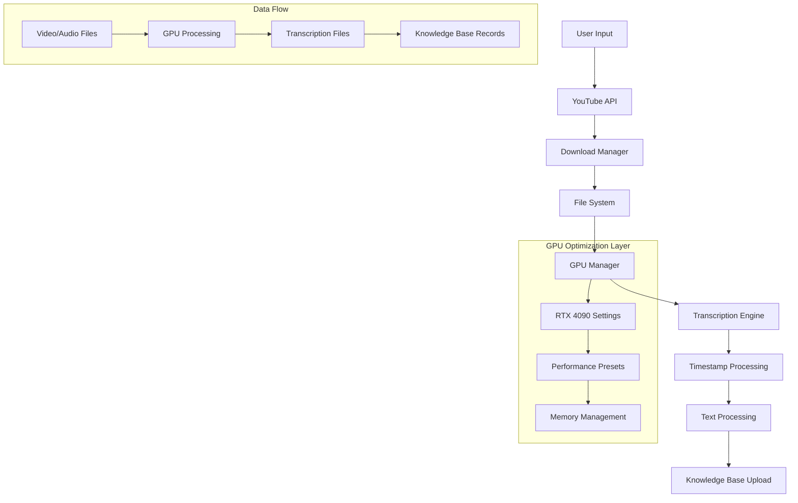

# System Patterns

## Architecture Overview
The application follows a modular architecture split across multiple Python files:
- `app.py`: Main application entry point with tab navigation
- `app0.py`: YouTube download functionality with API key rotation
- `app1.py`: Core transcription with RTX 4090 GPU optimization
- `app2.py`: Knowledge base upload functionality

## Key Technical Decisions

### 1. User Interface
- Built with Streamlit for interactive web-based interface
- Tabbed interface for separate functionalities (YouTube, Transcription, Upload)
- Performance preset dropdown with tooltips
- Sidebar settings configuration
- Real-time progress indicators and status updates
- GPU metrics display

### 2. Video Processing
- YouTube Data API integration with automatic key rotation
- Flexible download modes (date range, playlist, all videos)
- Support for both mp3 and mp4 formats
- Organized file storage with metadata preservation
- Error handling for download failures

### 3. RTX 4090 Optimized Transcription Engine
- Custom GPUManager class with RTX 4090 specific optimizations
- Hugging Face Transformers with Whisper models
- CUDA 12.9 support with TF32 precision
- SDPA (Scaled Dot Product Attention) for memory efficiency
- Chunk-based processing with configurable batch sizes
- Performance presets: STABIL, OPTIMIERT, SCHNELL, MAX. SCHNELL
- Timestamp integration with `[MM:SS - MM:SS]` format

### 4. Advanced Memory Management
- Automatic VRAM monitoring and cleanup
- Dynamic batch size adjustment based on available memory
- GPU memory fragmentation prevention
- Sequential processing to prevent threading conflicts
- Custom exception handling (GPUError, TranscriptionError, FFmpegNotFoundError)

### 5. File Management
- Consistent naming pattern: `YYYY-MM-DD_Title_videoId.ext`
- Metadata preservation in JSON format
- Automatic file organization and cleanup
- Skip existing files option
- Timestamped transcript output

### 6. Knowledge Base Integration
- Direct integration with ODIN AI API
- Structured metadata formatting
- Batch upload capability with error recovery
- Progress tracking for upload operations

## Technical Architecture Flow

## Error Handling & Recovery
- **GPU Error Management**: VRAM overflow detection, automatic fallback to CPU
- **API Quota Management**: YouTube API key rotation and rate limiting
- **Network Error Recovery**: Retry mechanisms for downloads and uploads
- **File System Error Handling**: Permission checks and path validation
- **Memory Management**: Automatic cleanup and garbage collection
- **Progress Tracking**: Real-time status updates with detailed error messages

## Performance Optimizations (Implemented)
1. **RTX 4090 GPU Acceleration**: CUDA 12.9 with TF32 and SDPA attention
2. **Performance Presets**: User-selectable settings from stable to maximum speed
3. **Batch Processing**: Configurable batch sizes (8-56) with dynamic adjustment
4. **Memory Management**: Intelligent VRAM usage with automatic cleanup
5. **Sequential Processing**: Prevents threading conflicts in Streamlit context
6. **Timestamp Integration**: Chunk-level time markers without word-level overhead
7. **Advanced Pipeline Configuration**: Optimized for RTX 4090 architecture

## Current Implementation Status
- ✅ **GPU Manager Class**: Complete with RTX 4090 optimizations
- ✅ **Performance Presets**: All 4 presets implemented with UI controls
- ✅ **Timestamp Processing**: Chunk-level timestamps with formatted output
- ✅ **Advanced Error Handling**: Custom exceptions and recovery mechanisms
- ✅ **Memory Management**: VRAM monitoring and automatic cleanup
- ✅ **CUDA 12.9 Integration**: TF32, SDPA, and memory-efficient processing