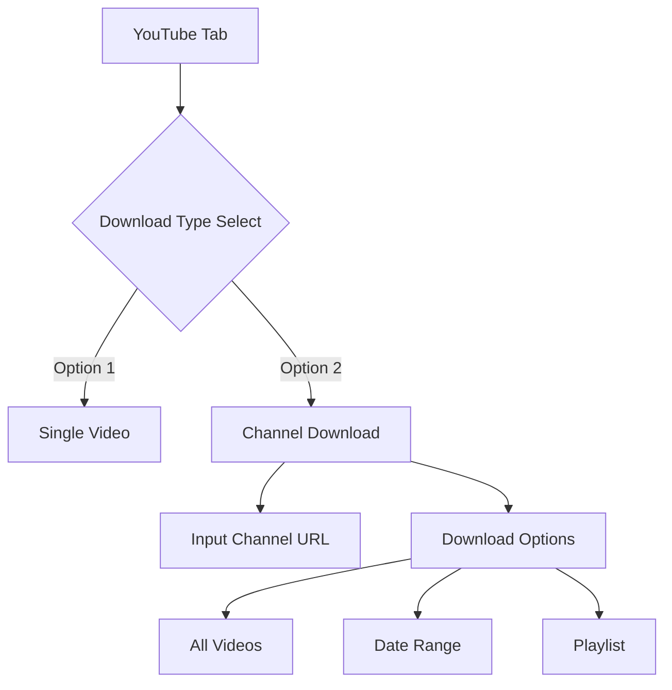
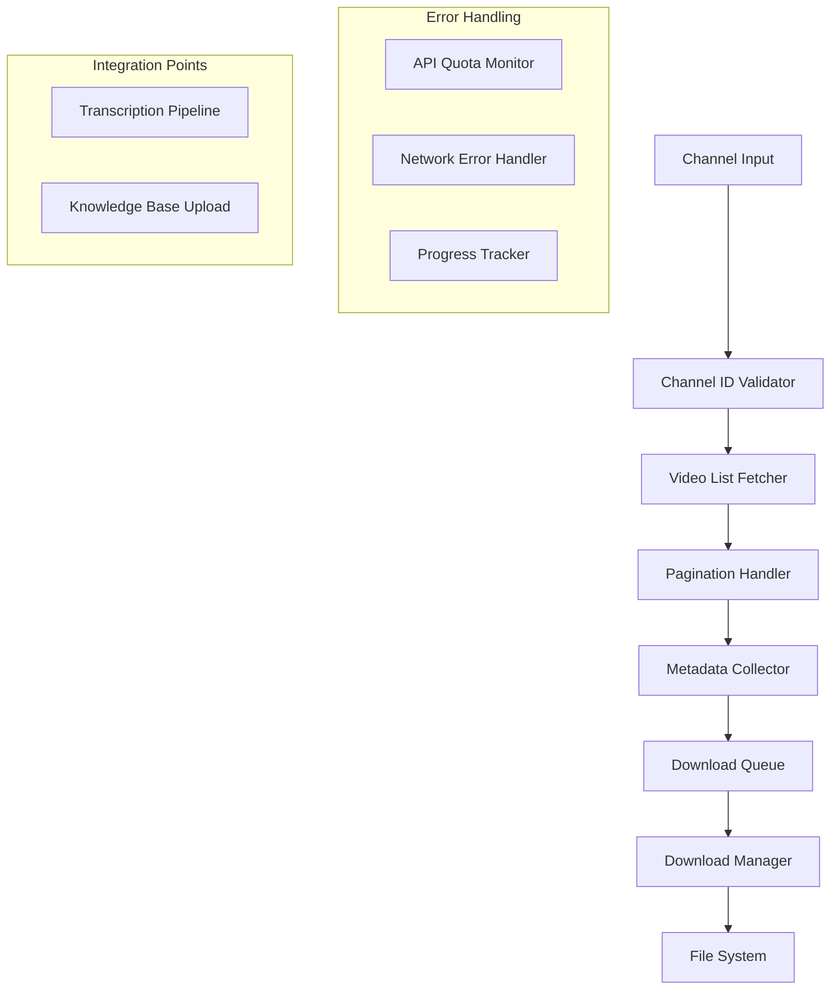
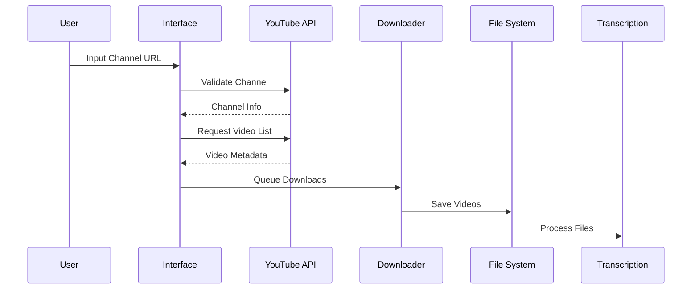

# YouTube Channel Download Enhancement Design

## Overview
This document outlines the architectural design for enhancing the existing YouTube download functionality to support complete channel downloads. The enhancement will allow users to download all videos from a YouTube channel, with options for date range filtering and playlist selection.

## 1. UI Enhancement

### Components:
- Radio button selection for download type (Single Video/Channel)
- Channel URL/ID input field
- Download scope selection:
  - All videos from channel
  - Date range selection
  - Playlist selection

## 2. Backend Architecture

### Key Components:

1. **Channel Validator**
   - Validates channel URL/ID format
   - Extracts channel information
   - Handles invalid inputs with clear error messages
   - Returns standardized channel metadata

2. **Video List Fetcher**
   - Retrieves complete video list using YouTube Data API
   - Implements pagination for large channels
   - Applies date range filters when specified
   - Handles playlist-specific retrievals
   - Manages API quota usage efficiently

3. **Queue Management**
   - Maintains ordered download queue
   - Tracks download progress
   - Handles failures with retry logic
   - Provides status updates to UI
   - Supports pause/resume functionality

4. **Integration Handler**
   - Seamlessly connects to existing transcription system
   - Manages metadata flow between components
   - Coordinates with upload system
   - Ensures data consistency across operations

## 3. Data Flow

## 4. Implementation Strategy

### Phase 1: UI Updates
1. Modify `show_youtube_tab()` in app0.py
   - Add radio button for download type selection
   - Implement channel URL/ID input field
   - Add download options interface
   - Create progress display components

### Phase 2: Backend Enhancement
1. Extend YouTube API Integration
   - Implement robust channel validation
   - Add pagination support for video listing
   - Create metadata caching system
   - Implement quota tracking

2. Queue Management System
   - Create prioritized download queue
   - Implement progress tracking
   - Add error recovery mechanisms
   - Support batch operations

### Phase 3: Integration
1. Connect to Existing Workflows
   - Link to transcription pipeline
   - Update progress tracking system
   - Enhance error handling
   - Implement cleanup procedures

## 5. Error Handling Strategy

### API Quota Management
- Track API usage per key
- Implement automatic key rotation
- Handle quota exhaustion gracefully
- Cache responses where appropriate

### Network Issues
- Implement exponential backoff retry logic
- Support download resumption
- Track partial progress
- Provide clear user feedback

### Resource Management
- Monitor available disk space
- Track memory usage
- Handle concurrent operations
- Implement cleanup routines

## 6. Success Metrics
1. Download Reliability
   - >95% successful download rate
   - Robust error recovery
   - Minimal user intervention required

2. Performance
   - Efficient API quota usage
   - Optimal download speeds
   - Responsive UI during operations

3. User Experience
   - Clear progress indicators
   - Meaningful error messages
   - Intuitive interface

## 7. Testing Requirements

### Unit Tests
- Channel URL validation
- Video list pagination
- Queue management
- Error handling

### Integration Tests
- End-to-end workflow
- API quota management
- Error recovery
- Data consistency

### Performance Tests
- Large channel handling
- Concurrent operations
- Resource usage
- Network resilience

## 8. Dependencies

### External
- YouTube Data API v3
- FFmpeg for media processing
- Network connectivity

### Internal
- Existing transcription pipeline
- Knowledge base upload system
- File management system

## 9. Future Enhancements

1. Advanced Features
   - Parallel downloading
   - Smart queue prioritization
   - Enhanced metadata extraction
   - Advanced filtering options

2. Performance Optimizations
   - Improved caching
   - Better resource management
   - Optimized API usage

3. User Experience
   - Download scheduling
   - Custom filtering
   - Batch operations
   - Enhanced progress tracking